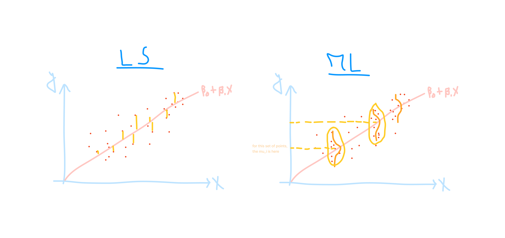
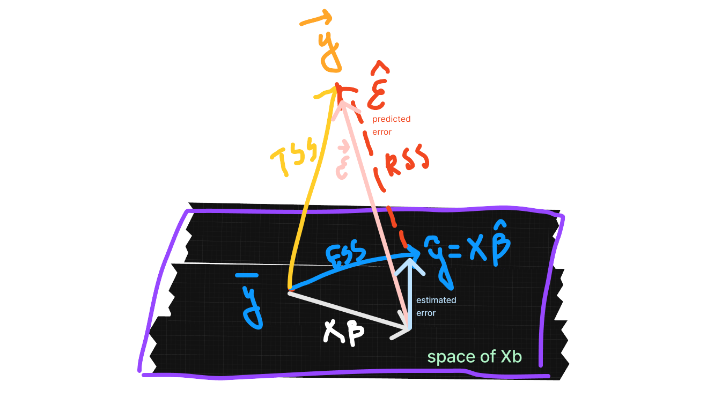
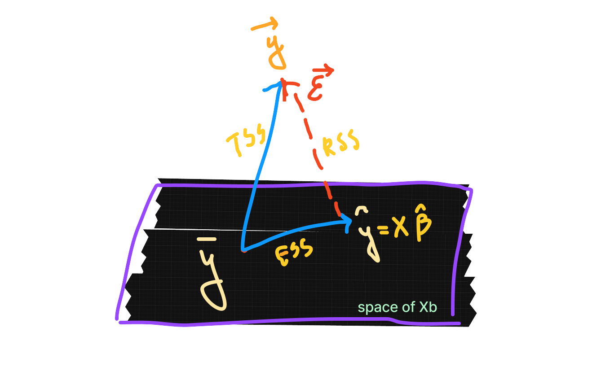
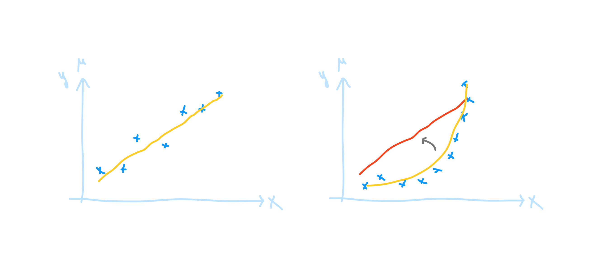
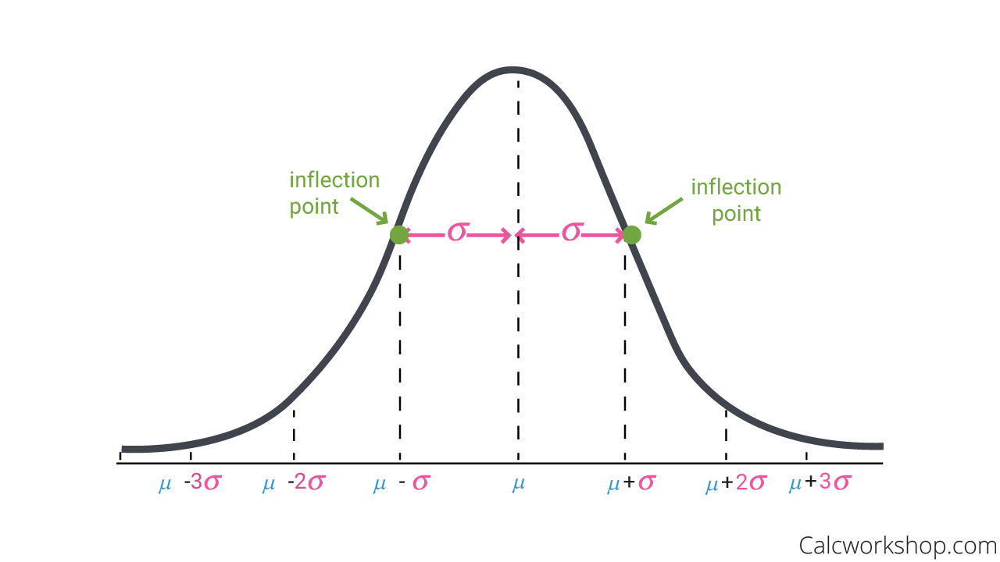

# Generalized Linear Models library from scratch

This is a python implementation of _Generalized Linear Models_ inspired by the theoretical material taken in a _Multivariate Statistics_ course and built based on _object-oriented programming_ design principles. It's made as an attempt to understand the statistical concepts behind GLM, practice efficient oop design and write python packages

## Table of Contents

## Installation

## Design

### Directory Structure

_under construction_

<!-- The library is structured in the following way:
```text
GLM-from-scratch/
│
├── glm/
│   ├── __init__.py
│   ├── glm.py
│   ├── link_functions.py
│   ├── loss_functions.py
│   ├── utils.py
│   └── validation.py
│
├── tests/
│   ├── __init__.py
│   ├── test_glm.py
│   └── test_link_functions.py
│
├── .gitignore
├── LICENSE
└── README.md   
``` -->

### UML Diagram

_under construction_

## Some theory and concepts

_beware some math and stats ahead :p_

### Main ideas:

Linear models were concieved originally by Gauss in the aim of finding a relationship between a response variable $y$ and explanatory variables $X$. 
- $y$ are independent
- $y$ are normally distributed with a mean $\mu$ so $y_i \sim N(\mu_i, \sigma^2)$  
- $\mu_i = X_i^T\beta$, the mean $\mu$ are related to the predictors $X$ by a linear model (linear in the parameters $\beta$, the $X$ can be transformed)

Then came the _[Generalized Linear Models](#generalized-linear-models-glm)_ (GLM) that are a generalization of the linear model, where the response variable $y$ follows a distribution from the _[exponential family](#exponential-family)_ (gaussian, binomial, poisson, gamma, etc.). As is the case in linear models, the aim of these models is to model the relationship between the response variable $y$ and the predictors $X$, and to make predictions based on this relationship. Here there are some few generalizations:  
- $y_i \sim exponentional\ family$  
- $g(\mu_i) = X_i^T\beta$, the mean $\mu$ are related to the predictors $X$ by a [link function](#link-functions-and-loss-functions) $g$ (not necessarily linear, logit, log, inverse...).  

In regular linear models, can use _[Least Squares](#linear-models-least-squares-and-residuals)_ or _[Maximum Likelihood Estimation](#maximum-likelihood-estimation)_ to estimate the coefficients $\beta$ (they are exactly the same in a normal distribution. In GLM only Maximum Likelihood - can think of OLS as a special case)

| Linear Model | Generalized Linear Model |
|--------------|---------------------------|
| $y_i \sim N(\mu_i, \sigma^2)$ | $y_i \sim Exponential\ family$ |
| $\mu_i = X_i^T\beta$ | $g(\mu_i) = X_i^T\beta$ |
| solved by OLS and MLE | solved by MLE |

In linear models, estimating the parameters come from solving one of these optimization problems:  
- **[Least Squares](#linear-models-least-squares-and-residuals)**: Optimization problem where we wanna minimize the sum of squared residuals, $min \sum_{i=1}^{n} (y_i - \hat y_i)^2$, where $\hat y_i = X_i^T\beta$; solved by differentiating and equating to 0. 
- **[Maximum Likelihood](#maximum-likelihood-estimation)**: Assuming some distribution on $y$, in LM $y \sim N(\mu, \sigma^2)$, where $\mu_i = X_i^T\beta$ sometimes $\mu_i$ will be above and sometimes below the line.  
Probability of obtaining that $y_i$ is $ \prod_{i=1}^{n} \frac{1}{\sqrt{2\pi\sigma^2}}e^{-\frac{(y_i-\mu_i)^2}{2\sigma^2}}$, we want to maximize this probability (choose the $\beta's$ that do), so we take the log likelihood, it's be a ***sum*** of the logs:  
$l(\beta) = \sum_{i=1}^{n} log(\frac{1}{\sqrt{2\pi\sigma^2}}e^{-\frac{(y_i-\mu_i)^2}{2\sigma^2}})= \sum_{i=1}^{n} log(\frac{1}{\sqrt{2\pi\sigma^2}}) - \sum_{i=1}^{n} \frac{(y_i-\mu_i)^2}{2\sigma^2}$  
The goal is to maximize this quantity  
$\iff$ maximize $- \sum_{i=1}^{n} \frac{(y_i-\mu_i)^2}{2\sigma^2}$ WHICH IS  
$\iff$ minimize $\sum_{i=1}^{n} (y_i - \mu_i)^2$  
$\iff$ minimize the sum of squared residuals (same as OLS).

| Least Squares | Maximum Likelihood |
|---------------|--------------------|
| $min \sum_{i=1}^{n} (y_i - \hat y_i)^2$ | $max \sum_{i=1}^{n} log(\frac{1}{\sqrt{2\pi\sigma^2}}) - \sum_{i=1}^{n} \frac{(y_i-\mu_i)^2}{2\sigma^2}$ |




### Generalized Linear Models (GLM):

Generalized Linear Models (GLM) are a class of models including linear, logistic and poisson regression, among others. These are generalizations of the linear model, following one of the exponential family distribution.  
The aim of these models is to model the relationship between the response variable $y$ ( a $(n \times 1)$ column vector) and the predictors $X$ ( a $(n \times p)$ matrix representing $p$ predictors), and to make predictions based on this relationship.  
Hence, the model is defined as $y = f(X\beta) + \epsilon$, where $f$ is a link function, $\beta$ is a $(p \times 1)$ column vector of coefficients, and $\epsilon$ is the error term. What we're looking for is $\hat y$, the predicted value of $y$ given $X$ and $\beta$, such that $\hat y = f(X\beta)$, this is also denoted as $E(y|X,\beta)$, the expected value of $y$ given $X$ and $\beta$.  

The parameters of the model are estimated by maximizing the likelihood of the observed data given the model. The likelihood is a function of the coefficients and is maximized by differentiating and equating to 0. This is equivalent to minimizing the loss function, which is a function that measures the difference between the predicted value and the actual value of the response variable (litteraly, negative log likelihood). The model is usually evaluated by deviance, a measure of the goodness of fit of the model and is used to compare the performance of different models.

### Linear Models

In a linear model, $y = X\beta + \epsilon$, and the error term is assumed to be normally distributed, indpendent and homoscedastic: $\epsilon \sim N(0, \sigma^2)$. The linear model is a special case of the GLM, where the response variable follows a gaussian distribution.   

3 main assumptions in linear models:  
1) [residuals _i.i.d_](#1-residual-assumption)  
2) [X is full rank](#rank-assumption)  
3) [influential points]()  

#### 1. residual assumption
(1) This was based on 3 assumptions:  
- $\epsilon_i$ are independent (ensures that $\hat\beta$ are unbiased estimators of the true coefficients by having $\mathbb{E}(\epsilon) =0 \iff \mathbb{E}(y) = X\beta$), this makes the off-diagonal elements of the covariance matrix of $\hat\beta$ to be 0
- $\epsilon_i$ are identically distributed (ensures that the variance of the residuals is constant, and it's $\sigma^2$)  
- $\epsilon \sim N(0, \sigma^2)$ (ensures that the residuals are normally distributed)  

So i.i.d $\epsilon \sim N(0, \sigma^2)$ with this covariance matrix:  

$\begin{bmatrix} \sigma^2 & 0 & 0 & \cdots & 0 \\ 0 & \sigma^2 & 0 & \cdots & 0 \\ 0 & 0 & \sigma^2 & \cdots & 0 \\ \vdots & \vdots & \vdots & \ddots & \vdots \\ 0 & 0 & 0 & \cdots & \sigma^2 \end{bmatrix}$

This is mind, $\epsilon$ is the only random variable in the model, $X$ and $\beta$ are fixed, so the distribution of $y$ is normal, $y \sim N(\mu, \sigma^2)$, where $\mu = X\beta$.

#### Least Squares

Let $V$ be the space of X, $X\gamma \in V$, and $y$ is a vector in $\mathbb{R}^n$.  
The least squares approach allows to get the $\hat y(=X\hat\beta)$ that minimizes the distance between $y$ and $X$ (the projection of $y$ onto the space of $X$), in other words, we're searching for the $\hat\beta$ from $argmin_{\gamma} \sum_{i=1}^{n} (y_i - X_i^T\gamma)^2$ (the $\gamma$ that minimizes the sum of squared residuals).  
The _residuals_ are the difference between the observed value of the response variable and the predicted value of the response variable, $e = y - \hat y$. The residuals are used to evaluate the performance of the model and to make predictions based on it.   
$\beta$ signifies the real coefficient describing the relationship between the predictors and the response variable, while $\hat \beta$ is the estimated coefficient that best describes this relationship, $\mathbb{E}(\beta)=\hat\beta$ ([unbiased estimator*](#unbiased-estimators), i.e. $\hat\beta \approx \beta$ when $n \to \infty$).



_In this fig it's worth noting the 2 types of errors we have_:  
* __error of prediction__ ($\hat \epsilon$, predicting a new y from a new obs of X will have an error that's based on $X\hat\beta$ and $y$)  
* __error of estimation__ (diff between $X\beta\  and\ X \hat \beta$, when we do estimation we don't know real values of $\beta$, we will estimate $\hat\beta$ and predicted value will be $X\hat\beta$)  
$predicted\ error \gt estimation\ error$.

To estimate the coefficients of the model, we minimize the _residual sum of squares_ (RSS), which is the sum of the squared residuals, $RSS = \sum_{i=1}^{n} (y_i - \hat y_i)^2$. The coefficients are estimated by minimizing the RSS, i.e. finding the coefficients that minimize the difference between the observed value of the response variable and the predicted value of the response variable.  
Enters the _normal equation_ that gives us the $\hat \beta$ that minimizes the RSS, $\hat \beta = (X^TX)^{-1}X^Ty$.   
So $E(y|X,\beta) = X\beta = X(X^TX)^{-1}X^Ty = Hy$,  
where $H = X(X^TX)^{-1}X^T$ is the _hat matrix_ (orthogonal projection) that projects $y$ onto the space of $X\beta$.

#### 2. rank assumption

$\hat \beta = (X^TX)^{-1}X^Ty$ is true $iff$ $X^TX$ is invertible, and $X$ is full rank, which is the case when the predictors are linearly independent. So can conclude 2 clear scenarios where this isn't met:  
  
- $p>n$, we have more predictors than observations, so we can't estimate the coefficients, the rank of $X \lt p$ thus $X^TX$ is not invertible  
- When the predictors are linearly dependent, the rank of $X \lt p$ thus $X^TX$ is not invertible  

To deal with 1, use _regularization_ (L1, L2, elastic net), or _dimensionality reduction_ (PCA), or _feature selection_ (backward, forward, stepwise selection).

To deal with the 2nd case, we can either remove colinear predictors or (do smtg else i forgot what). When $X$ is not full rank than some predictors are linearly dependent on the others. Interestingly, in practice we might have a predictor that is close to being a linear combination of other predictors (but not exactly), in this case to test for multicollinearity we can:    
- comparing ratio between the largest and smallest eigenvalues of the corr matrix R (the smallest eigenvalue is 0 when it's not full rank), if it's very large, then we have multicollinearity, there is no stat test to check if it's significantly greater than 0 but some empirical values are used to check for it like 500 or 1000 (arbitrary threshold); thus when ration is greater than this value, we have strong colinearity.  
- perform several Linear regressions between predictors and check the $R^2$ values, if they are close to 1. i.e., try to explain one predictor with the others, the model that shows a near 1 $R^2$ means that this predictor is very well explained by the others, it's a linear combination of them thus it's a good candidate to be removed. (e.g., explain x1 by x2 & x3, then x2 by x1 & x3, then x3 by x1 & x2, check for $R^2$ values)   
VIF (Variance Inflation Factor) is used here, as $VIF = \frac{1}{1-R^2}$, when $R^2 \approx 1$, then $VIF \approx \infty$, and when $R^2 \approx 0$, then $VIF \approx 1$ (compute a VIF for each predictor)

### Logistic Models 

$y$ ~ $B(1, \pi(X_i))$, is a Bernoulli random variable, where $\pi(X_i)$ is the probability of success given $X_i$.

#### Statistical tests:  

**Testing the significance of a coefficient**:  
- _Null hypothesis_: the coefficient is not significant, $H_0: \beta^*_j = 0$   
- _Alternative hypothesis_: the coefficient is significant, $H_1: \beta^*_j \neq 0$
- Test statistic $T_n = \frac{\hat \beta_j}{\hat S(\hat \beta_j)}$, converging to a standard normal distribution $N(0,1)$ as $n \to \infty$;- it's in fact a z-score, and it follows a t-distribution with $n-p-1$ degrees of freedom.  
- Wald test (Student)  

**Comparing nested models**:  
Given $M_q$ and $M_{q-1}$ where $M_q$ has $q$ predictors (full) and $M_{q'}$ has $q'$ predictors (reduced nested model), we can compare the performance of the two models by performing an _anova_ test. Let $\sigma^2*$ be the variance of the residuals of the big model $M_q$, and $\sigma^2$ be the variance of the residuals of the smaller model $M_{q'}$.  
- _Null hypothesis_: the simpler model $M_{q'}$ is better, $H_0: \sigma^2 = \sigma^2*$ (as if the added predictors are not significant)  
- _Alternative hypothesis_: the full model $M_q$ is better, $H_1: \sigma^2 \lt \sigma^2*$ (for the nested model)   
- Test statistic is the likelihood ratio test, $LR = -2(log(L(M_{q'})) - log(L(M_q)))$, which follows a chi-squared distribution with $q-q'$ degrees of freedom.  
- Devian test (F-test)

#### Evaluation  


### Evaluation
_But what is $R^2$ ?_

Some definitions:
- TSS: total variability in the response variable, $TSS = \sum_{i=1}^{n} (y_i - \bar y)^2$ (inherent variability in the response variable)   
- ESS: variability explained by the model, $ESS = \sum_{i=1}^{n} (\hat y_i - \bar y)^2$ (variability explained by the model), how much the model was able to explain the variability in the response variable (to get from TSS)  
- RSS: variability not explained by the model, $RSS = \sum_{i=1}^{n} (y_i - \hat y_i)^2$ (variability not explained by the model)  

- $R^2$: proportion of variability that can be explained using X, the closer to 1 the better the model is,  
proportion of variance explained by the model $R^2 = \frac{ESS}{TSS}$, where $ESS$ is the explained sum of squares and $TSS$ is the total sum of squares.   
RSS is the residual sum of squares, $RSS = \sum_{i=1}^{n} (y_i - \hat y_i)^2$, $ESS = \sum_{i=1}^{n} (\hat y_i - \bar y)^2$, and
$TSS = \sum_{i=1}^{n} (y_i - \bar y)^2$, where $\bar y$ is the mean of the response variable.  
In here $RSS$ is the error that the model makes, also seen as the projection of $y$ onto the space of $X\beta$. The smaller the distance is, the closest is our $\hat y$ to $y$, the better the model is and the more $R^2 \approx 1$  
  

- Adjusted $R^2$: penalizes the $R^2$ for the number of predictors in the model, $R^2_{adj} = 1 - \frac{RSS/(n-p-1)}{TSS/(n-1)}$, where $p$ is the number of predictors in the model. When the number of predictors increases, the $R^2$ also increases, even if the predictors are not significant. It's mainly used to compare the performance of models with different numbers of predictors (because when p increases, the variance of the model increases, which is translated in the equation by the increase of the RSS(?), so the adjusted $R^2$ will decrease)

### Maximum Likelihood Estimation

_Likelihood is not probability_  
- probability of getting this y given a particular model, pictured as an area under the curve of a fixed distribution: $Pr(data/distribution)$  
- likelihood is about fitting a model given known data, pictured as y-axis points of distributions that can be moved: $L(distribution/data)$ ([more here](https://www.youtube.com/watch?v=p3T-_LMrvBc))

![likelihood vs probability statquest note]

The maximum likelihood is an optimization problem revolving around maximizing the likelihood of the observed data given the model. "Likelihood" is a term often used in tandem with "probability", but they are not the same.  
By defintion, the likelihood is a measure of how well a statistical model explains the observed data. In here this optimization problem is about maximizing the probability of observing the data to estimate the parameters given that it follows a particular distribution, with the assumption that the data is independent and identically distributed (i.i.d).  
In other words having $f(y_i|\mu_i)$, the probability of observing $y_i$ given $\mu_i$ with $f$ being the distribution, and $\mu_i = X_i^T\beta$, the probability of observing $y_i$ given $X_i$ and $\beta$, the likelihood of observing the data is $L = \prod_{i=1}^{n} f(y_i|\mu_i)$, we want to maximize $L$ to get the $\beta$ that best explains the data.  
This product is usually hard to work with, so we take the log likelihood, $l = \sum_{i=1}^{n} log(f(y_i|\mu_i))$, and we want to maximize this quantity.   
- _gaussian distribution_, the log likelihood is $l = \sum_{i=1}^{n} log(\frac{1}{\sqrt{2\pi\sigma^2}}) - \sum_{i=1}^{n} \frac{(y_i-\mu_i)^2}{2\sigma^2}$ is equivalent the OLS problem, making this a generalized approach for different types of distributions.  
- _binomial distribution_, the log likelihood is $l = \sum_{i=1}^{n} y_i log(\mu_i) + (1-y_i)log(1-\mu_i)$, where $y_i$ is the number of successes in $n$ trials, and $\mu_i$ is the probability of success.  
- _poisson distribution_, the log likelihood is $l = \sum_{i=1}^{n} y_i log(\mu_i) - \mu_i$ and $\mu_i$ here is the $\lambda$ parameter of the poisson distribution so $\mu_i = e^{X_i^T\beta}$ and y is the number of events in a fixed interval of time.


### Link functions and loss functions: 

_The link function arises from ML_

What distinguishes GLM from the linear model is the ___link function___ that connects the linear predictor to the expected value of the response variable.  
The linear predictor is defined as $ \eta = X\beta$, where $\beta$ is a $(p \times 1)$ column vector of coefficients. The link function is a function $g$ such that $g(\mu) = \eta$, where $\mu$ is the expected value of the response variable. 
The link function is chosen based on the distribution of the response variable. For example, in the case of the _gaussian distribution_, the link function is the _identity function_, while for the _Bernoulli distribution_, the link function is the _logit function_.

| LM | GLM |
|----|-----|
| $\mu_i = X_i^T\beta$ | $g(\mu_i) = X_i^T\beta$ |



This link function hass to be   
- ___monotonic___ (so that the relationship between the predictors and the response variable is preserved)  
- ___differentiable___ (so that we can estimate the coefficients of the model)  
- ___invertible___ (so that we can get back to the mean from the linear predictor).

In the case of binary regression, it's the Bernoulli distribution with some probability p:  
$y_i \sim Bernoulli(p)$, $E(y_i) = \mu_i = p_i$, and we want p to be between 0 and 1, so the most common link function is the _logit function_ $logit(\mu_i) = log(\frac{\mu_i}{1-\mu_i}) = X_i^T\beta$;  where $\mu_i \in [0,1]$, $logit(\mu_i) \in \mathbb{R}$
$\iff \frac{\mu_i}{1-\mu_i} = e^{X_i^T\beta}$,   
$\iff \mu_i = \frac{e^{X_i^T\beta}}{1+e^{X_i^T\beta}} = \frac{1}{1+e^{-X_i^T\beta}}$    
$\iff \mu_i = \sigma(X_i^T\beta)$, where $\sigma$ is the sigmoid function.  

a link function is not a transformation of the response variable, only the $\mu$ is tranformed.

| Distribution | Link function name | Mathematical expression | prediction | $y \in$ |
|--------------|--------------|--|--|--|
| Gaussian     | Identity     | $g(\mu_i) = \mu_i$ | $\mu_i = X_i^T\beta$ | $\mathbb{R}$ (continuous) |
| Bernoulli    | Logit        | $g(\mu_i) = log(\frac{\mu_i}{1-\mu_i})$ | $\mu_i = \frac{1}{1+e^{-X_i^T\beta}}$ | $\{0,1\}$ (discrete) |
| Poisson      | Log          | $g(\mu_i) = log(\mu_i)$ | $\mu_i = e^{X_i^T\beta}$ |   $\mathbb{N}$ (discrete) |


Another important concept in GLM is the ___loss function___, which is a function that measures the difference between the predicted value and the actual value of the response variable. The loss function is used to estimate the coefficients of the model by minimizing the difference between the predicted value and the actual value of the response variable. It's usually chosen based on the distribution of $y$, for example, in the case of the _gaussian distribution_, the loss function is the _squared error function_, while for the _binomial distribution_, the loss function is the _log loss function_ (not going to dive deep in it, but it's the negative log likelihood of the observed data given the model).  This is seen in the MLE problem where we want to maximize the likelihood of the observed data given the model, which is equivalent to minimizing the loss function.

In each model, the coefficients are estimated by minimizing the loss function. The linear model uses _Ordinary Least Squares_ (OLS) to estimate the coefficients, while the logistic and poisson models use _Maximum Likelihood Estimation_ (MLE) to estimate the coefficients. The coefficients are estimated by maximizing the likelihood of the observed data given the model. The ***likelihood*** is a function of the coefficients and is maximized by finding the coefficients that maximize the likelihood of the observed data.   
So our goal is to get the $\beta$ that optimizes the performance of the model, i.e. minimizes the loss function or maximizes the likelihood function. (_loss function is the negative log likelihood_)

### Evaluating the model:  

An important aspect of building a GLM is to understand the statistical properties of the model, like _residuals_, _deviance_, and _confidence intervals_.  
Evaluating the performance of a model, we often care to see which predictors are significant, and which are not. This is done by performing _hypothesis tests_ on the coefficients of the model.  

We can compare between models and nested models by _anova_ which comes to compare the deviance of the models. The _deviance_ is a measure of the goodness of fit of the model and is used to compare the performance of different models. Other measures of goodness of fit include the _AIC_ and _BIC_, and even $R^2$, _odd ratios_, and _incident rate ratios_ are used to evaluate the performance of the model.

### Regularization

_Motivation:_  
When validating the full rank assumption, if $p>n$, X becomes singular $\implies$ $X^TX$ is not invertible, so we can't estimate the coefficients :/  
Even if p is not greater than n but is close to it, teh huge number of predictors increases teh variance of the model and makes the statistical tests less powerful. there are variable selection algorithms for that but with $2^p$ possible models to compare, it's computationally expensive.
So that is a problem.  

Starting from a classical linear model, we can add a penalty term to the loss function to prevent overfitting, this is called _regularization_.

classical:  
$$ RSS = (y - X\beta)^T(y - X\beta)$$  
$$ \hat \beta = (X^TX)^{-1}X^Ty$$  

Penalized (ridge example):  
$$ RSS(\lambda) = (y - X\beta)^T(y - X\beta) + \lambda \beta^T\beta$$  


#### Ridge

So in other words:   
$\sum \beta_j^2 \leq t$ is the constraint, and the solution is the $\beta$ that minimizes the RSS, so the solution is the $\beta$ that minimizes the RSS and satisfies the constraint.

$$RSS(\lambda) = (y - X\beta)^T(y - X\beta) + \lambda \sum_{j=1}^{p} \beta_j^2 $$  
$$\hat \beta^{ridge} = argmin_{\beta} RSS(\lambda)=  argmin_{\beta} \sum_{i=1}^{n} (y_i - X_i^T\beta)^2 + \lambda \sum_{j=1}^{p} \beta_j^2$$  


$\lambda$ is the penalty term, and it's a hyperparameter that controls the amount of regularization applied to the model. When $\lambda = 0$, the model is equivalent to the classical linear model, and when $\lambda \to \infty$, the coefficients of the model are shrunk towards zero.  

Now the formula mentioned above for linear models can be generalized by using negative log likelihood instead of least squares:  
$$\hat \theta^{ridge} = argmin_{\theta} -log(L(\theta)) + \lambda \sum_{j=1}^{p} \theta_j^2$$


#### Lasso  

The lasso is another type of regularization that uses the L1 norm of the coefficients as the penalty term (absolute values of teh estimates). The lasso is used to perform variable selection by setting some of the coefficients to zero. In practice this is the main difference between the lasso and ridge regression (considered as an advantage of the lasso).

#### Elastic Net

Combination of lasso and ridge  
Norm 1 and norm 2 in penalty term, so it's a mix of the two. (associate the penalty term with a weight $\alpha$, to weight both penalties by $\alpha$ and $1-\alpha$):  
$$RSS(\lambda) = (y - X\beta)^T(y - X\beta) + \lambda \alpha \sum_{j=1}^{p} |\beta_j| + \lambda (1-\alpha) \sum_{j=1}^{p} \beta_j^2$$  
- if $\alpha = 0$, it's ridge  
- if $\alpha = 1$, it's lasso  

___choosing $\lambda$:___  
- Cross validation: split the data into training and validation sets, train the model on the training set, and evaluate the performance of the model on the validation set. Repeat this process for different values of $\lambda$ and choose the value of $\lambda$ that gives the best performance on the validation set.  
- Estimates will depend on this choice, we plot them as a function of $\lambda$ (regularization path) and choose the one that gives the best performance. Notice how the coefficients are shrunk towards zero as $\lambda$ increases.


_Some other important concepts in statistics_  
### _Unbiased estimators:_  
The idea of bias comes from something in this example:  
If we take $\hat \mu$ (the mean) as estimator of $\mu$, for some observations we will have $\hat \mu \gt \mu$ (overestimating) and for others $\hat \mu \lt \mu$ (underestimating), but avergaing on large sets of observations we expect $\hat \mu = \mu$, so the estimator is unbiased, "unbiased estimator does not systematically over- or under-estimate the true parameter"  (ISLR). This property holds in least squares, where coefficients are unbiased estimators of the true coefficients, estimating coef on one dataset wont make our estimates exactly equal to the true values, but averaging on large sets of datasets will make them equal.

### Covariance matrix:  

This is a bit tricky everytime I read about it.  
The covariance matrix is a square matrix that contains the variances of the variables on the diagonal, and the covariances between the variables on the off-diagonal. It's a measure of how much two variables change together.  
In mathematical formulation, the covariance matrix of a random vector $X$ is defined as $Cov(X) = \mathbb{E}[(X-\mu)(X-\mu)^T]$, where $\mu$ is the mean of $X$. Let's break this down with an example:  
- $X = \begin{bmatrix} X_1 \\ X_2 \end{bmatrix}$, where $X_1$ and $X_2$ are random variables  
- $\mu = \begin{bmatrix} \mu_1 \\ \mu_2 \end{bmatrix}$, where $\mu_1$ and $\mu_2$ are the means of $X_1$ and $X_2$  
- $Cov(X_1,X_1)=Var(X_1) =\mathbb{E}[(X_1-\mu_1)(X_1-\mu_1)]$ = $\mathbb{E}[(X_1-\mu_1)^2]$ is the variance of $X_1$ (formula of a variance from the first statistics course), by definition it's the average of the squared differences between the values of $X_1$ and the mean of $X_1$, where a large variance means that the values of $X_1$ are spread out having values far from the mean,
[probabilitycourse.com](https://www.probabilitycourse.com/chapter3/3_2_4_variance.php#:~:text=By%20definition%2C%20the%20variance%20of,values%20far%20from%20its%20mean.)  
- $Cov(X_1,X_2) = \mathbb{E}[(X_1-\mu_1)(X_2-\mu_2)]$ is the covariance between $X_1$ and $X_2$, it's a measure of how much $X_1$ and $X_2$ change together, if it's positive, then when $X_1$ is above its mean, $X_2$ is also above its mean, and if it's negative, then when $X_1$ is above its mean, $X_2$ is below its mean.  
- The cov formula above, when expanded for a matrix to include all the variables, gives the covariance matrix also denoted $Var(X)$ (ESLR) or even $\Sigma$ (ISLR).   
- $\Sigma = \begin{bmatrix} Var(X_1) & Cov(X_1,X_2) \\ Cov(X_2,X_1) & Var(X_2) \end{bmatrix}$
- Let $A$ be a Linear transformation matrix, then  
$Var(AX) = A\Sigma A^T$, this is a property of the covariance matrix, it's invariant under linear transformations (derivation:)

![cov between 2 vars]


### Probability distributions

_A refresher on some distributions_

- The _gaussian distribution_ is characterized by the probability density function $f(x) = \frac{1}{\sqrt{2\pi\sigma^2}}e^{-\frac{(x-\mu)^2}{2\sigma^2}}$, where $\mu$ is the mean and $\sigma^2$ is the variance. Here is a breakdown of this function because it's very nice to look at; ([source](https://youtu.be/UVvuwv-ne1I?si=z6PAEIGR1uOdMoG9)):  
    - The $e^{-\frac{1}{2}}$ term gives it its shape, it's a bell curve. The exponent is negative, so that the curve is concave down (particularly at $\mu ± \sigma$, this is why the 2 is added in denominator to scale it here instead of 2 times this value - check other elements of the exponent), and the $e$ is there to make it positive, so that the curve is always positive.  
    - The $(x-\mu)^2$ term is the exponent centered around the mean $\mu$  
    - The $\sigma^2$ term in the denominator of the exponent is the variance to make it evenly distributed, and controls the spread of the curve, it's put in the denominator because the exponent is negative, this the variance becomes directly proportional to the spread of the curve   
    - The $\frac{1}{\sqrt{2\pi\sigma^2}}$ term is the normalization constant, it ensures that the distribution is indeed a probability density function, i.e. $\int_{-\infty}^{\infty} e^{-\frac{(x-\mu)^2}{2\sigma^2}}dx = \sqrt{2\pi\sigma^2}$, and multiplying by the $\frac{1}{\sqrt{2\pi\sigma^2}}$ term ensures that the area under the curve is one ($\int_{-\infty}^{\infty} f(x)dx = 1$)


        | x        | $-\infty$ | $\mu - \sigma$ | $\mu$ | $\mu + \sigma$ | $+\infty$ |
        |----------|---------|----------------|-------|----------------|---------|
        | f(x)     | 0       | less than max  | max   | less than max  | 0       |
        | f'(x)    | +       |      +         | 0     |      -         | -       |
        | f''(x)   | +       |      0         | -     |      0         | +       |


- The _binomial distribution_ is characterized by the probability mass function $f(y) = \binom{n}{y}p^y(1-p)^{n-y}$, where $n$ is the number of trials, $y$ is the number of successes, and $p$ is the probability of success. The binomial distribution is used to model the _number of successes_ in a _fixed number of trials_ 
- The _poisson distribution_ is characterized by the probability mass function $f(y) = \frac{\lambda^y}{y!}e^{-\lambda}$, where $\lambda$ is the average number of events (also std. dev.) in a fixed interval of time. The poisson distribution is used to model the _number of events_ in a _fixed interval of time_

_note on density vs mass_:  
- A _probability density function_ is a function that describes the likelihood of a **continuous** random variable taking on a particular value. The area under the curve of a probability density function =1    
- A _probability mass function_ is a function that describes the likelihood of a **discrete** random variable taking on a particular value. The sum of the probabilities of all possible values of a discrete random variable =1


### Exponential Family


### Hypothesis Testing

$H_0$: null hypothesis, default state of belief  
$H_1$: alternative hypothesis, what we want to prove  

For any statistical test we have a random variable following a random distribution(?)

question of interest here: expectation of paramater estimator is 0

### Multiple Testing Correction

_Motivation:_  
When we do multiple hypotehsis tests $H_0^1, H_0^2, ..., H_0^m$, the probability of making a type I error increases with the number of tests, so we need to correct for this, _e.g., gets crazy with higher number m: 5% * 100,000 genes = 5,000 errors_.  

So problem: too many type I errors.  

Some terminology to note:  
- **type I error:** rejecting a true null hypothesis when it's true $\iff FP \iff False\ discovery$  
$\alpha = P(reject\ H_0|H_0\ is\ true)$ = rate of false discoveries  
- **type II error:** failing to reject a false null hypothesis $\iff FN$  
- **FWER:** family-wise error rate, the probability of making at least one type I error in a family of tests  
$FWER = P(V \ge 1)$, where $V$ is the number of false positives.   
- **FDP:** false discovery proportion, the proportion of false positives among the rejected hypotheses  
$FDP = \frac{V}{max(R, 1)}$, where $V$ is the number of false positives and $R$ is the number of rejected hypotheses.
- **FDR:** false discovery rate, the expected proportion of false positives among the rejected hypotheses  
$FDR = E(\frac{V}{R}|R>0)$, where $V$ is the number of false positives and $R$ is the number of rejected hypotheses.  
- **Confusion table**:  

|          | Accept $H_0$ | Reject $H_0$ | total |
|----------|--------------|--------------|--|
| $H_0$ true | U           | V=type I = FP           | $m_0$ |  
| $H_0$ false | T=type II = FN           | S           | $m_1$ |  
| total    | W       | R          | $m$ |   

- **tolerance:** the proportion of false positives that are acceptable  
$tolerance = \frac{V}{R}$?  
- **power:** the probability of rejecting a false null hypothesis  
$power = 1 - P(type II error)$  
_it's more powerful when we make more true discoveries_

Assuming tests are independent $FWER= P(V \ge 1)= 1 - P(no\ type\ I\ errors)=1 - (1-\alpha)^m$  
Taking $\alpha=0.05$, when we plot $1 - (1-0.05)^m$, we see that it increases very fast (exponentially). Changing alpha doesn't really help as the shape of teh cruve will be the same, so we need to correct for this.

![plot of the function]  
_e.g., type I error rate $\alpha$=0.05, if we do 50 tests, the probability of making at least one type I error is $1-(1-0.05)^{50} \approx 0.92$ (near 100% chance of making a type I error in m tests)_   

>> Distinguish between different types of multiplicities:  
1-2 sample problems with m different endpoints (m=p in linear regression), this means m statistical tests for m parameters  
k-sample problems with localized comparisons: k-1 if one control group, k(k-1)/2 if all pairwise comparisons  

### Controling the FWER  

> Controling means making at least one type I error in a family of tests, this will not only decrease the number of false discoveries but also the number of true discoveries (very few $H_0$ will be rejected), making the procedure too conservative for large m ($ESLII$)  

***Bonferroni** (single step method)*:    
Makes each test more stringent to make $FWER \le \alpha$, so $\alpha/m$ is the new $\alpha$ for each test.    
It's single step because each test defines at a predefined $\alpha/m$ level, regardless of the observations (same level for the m tests) 

>>> Remember $P(A \cup B) \le P(A) + P(B)$  
$FWER = \bigcup_{i=1}^{m} P$(making type I error in test j) $\le \sum_{i=1}^{m} P$(..)  
with $\sum_{i=1}^{m} P$(making type I error in test j) = 
$\alpha/m + \alpha/m + ... + \alpha/m = \alpha$  
Hence, $FWER \le \alpha$

***Holm** (stepwise: step-down method)*:  
Also guarantees $FWER \le \alpha$, BUT it's more powerful than Bonferroni (allows for more discoveries - at least as many as Bonferroni)  

1. sort p-values from smallest to largest, $p_{(1)} \le p_{(2)} \le ... \le p_{(m)}$  
2. compare $p_{(j)}$ with $\alpha/(m-j+1)$  
3. reach index $i$ where $p_{(i)} \gt \alpha/(m-i+1) \implies$ fail to reject  
4. All remaining p-values are also failed to reject  

It's called step-down because the denominator is decreasing in each step (starting with a large set of hypothesis that's going down). It ensures that all tests that would be rejected by Bonferroni are also rejected by Holm. It is a strong control (i.e., it's conservative) but it's more powerful than Bonferroni.

![bonferroni & holm index vs sorted pval plot]

***Hochberg** (step-up method)*:  
Also guarantees $FWER \le \alpha$, BUT it's way more powerful than Bonferroni & Holm, HOWEVER, its main drawback is it relying on a strong assumption that the tests are independent (there is a cost for this power).    

_Same principle but starts from the largest p-value and goes down_  
1. sort p-values from largest to smallest, $p_{(m)} \ge p_{(m-1)} \ge ... \ge p_{(1)}$  
3. compare $p_{(m)}$ with $\alpha$:  
    a. if $p_{(m)} \le \alpha$, reject all $H_0$  
    b. else compare $p_{(m-1)}$ with $\alpha/2$  
    c. continue until $p_{(m-i+1)} \le \alpha/i$   

### Controling the FDR  

_Here we have a different guarantee, we want to control the proportion of false discoveries among the rejected hypotheses_  
As said previously, FWER is too conservative for large m, we might not have any discoveries at all. In some contexts (liek GWAS), we want to get some discoveries and experiment with them, so we need a less conservative method, enters FDR.  

again by definition: $FDR = E(\frac{V}{R or 1})$, where $V$ is the number of false positives and $R$ is the number of rejected hypotheses.  
We're controling the rate of false discoveries to be less than alpha rather than the probability of making at least one error in m tests (FWER) < $\alpha$ (we might take $\alpha$ to be something liek 10 or 20%)  
_In a programming context $FDR=\frac{FP}{FP+TP}$ and $precision=\frac{TP}{TP+FP}$, so $FDR=1-precision$._  

***Benjamini-Hochberg** (step-up method)*:  
1. sort p-values from smallest to largest, $p_{(1)} \le p_{(2)} \le ... \le p_{(m)}$  
2. find the largest index $i$ such that $p_{(i)} \le \frac{i}{m}\alpha$  
3. reject all $H_0^j$ for $j \le i$  

![plot comparing curves with FWER approaches]


## End notes

Sources:  
- [Elements of Statistical Learning](https://hastie.su.domains/ElemStatLearn/) textbook by Hastie, Tibshirani, and Friedman  
- [Introduction to Statistical Learning](https://hastie.su.domains/ISLR/) textbook by James, Witten, Hastie, and Tibshirani
- [Introduction to Generalized Linear Models]() textbook by Dobson and Barnett   
- [Linear Models with R]() textbook by Faraway   
- [Generalized Linear Models (GLM's)](https://www.youtube.com/playlist?list=PLJ71tqAZr197DkSiGT7DD9dMYxkyZX0ti) youtube playlist by Meerkat Statstics
- [StatQuest](https://www.youtube.com/c/joshstarmer) youtube channel by Josh Starmer (amazingness)  
- [Data Science Methods and Statistical Learning](https://www.youtube.com/playlist?list=PLSkGXOii6-CRlwmik1l1h9pG4Uuq0TgeT) - U Toronto by Prof. Samin Aref (particularily MT correction)

Visualizations drawn with <a href='figma.com'>  </a>  
Licensed by the [MIT License](./LICENSE.md).  